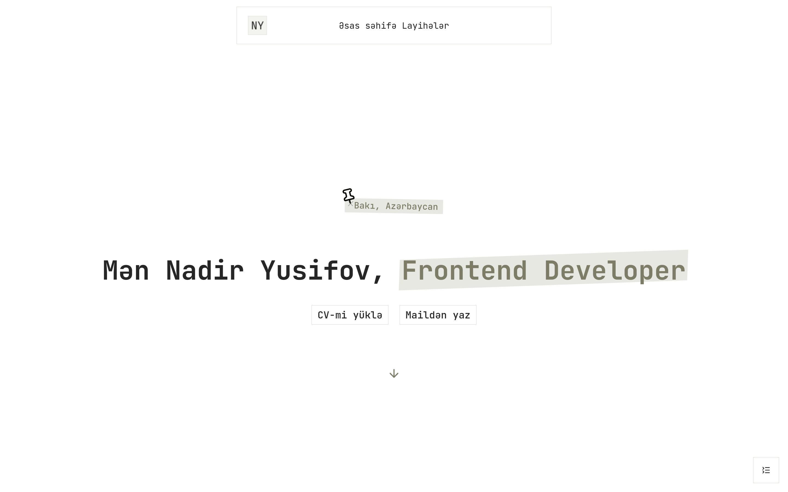

# nadiryusifovportfolio veb sayt

[Astro](https://astro.build) çərçivəsi ilə hazırlanmış portfolio veb saytım.



Layihənin `src` yolunda olan "folder structure" yolu:
```md
└── src/
    ├── assets
    ├── components
    ├── content
    ├── data
    ├── layouts
    ├── lib
    ├── pages
    ├── styles
    └── content.config.ts
```
GitHub-da [bura keçid](https://github.com/NadirYusifov/nadiryusifovportfolio/tree/main/src) edib incələyə bilərsiniz.

---

## 📄 Layihə haqqında:
Bu veb sayt [Astro](https://astro.build) çərçivəsi ilə hazırlanıb. Dizaynı özüm fikirləşmişəm. Rəsmi olaraq front-end çərçivəsi olaraq [React](https://react.dev/) əlavə olunub. Layihə [Netlify](https://www.netlify.com/) vasitəsi ilə deploy edilib. 

Əlavə olaraq layihədə istifadə etidyim paketlərə baxmaq istəyirsizsə [Referances](http://nadiryusifovportfolio.netlify.app/referances) hissəsinə keçid edib baxa bilərsiniz.

Mətnləri isə [Keystatic](https://keystatic.com/) ilə həll etmişəm sıfırdan Admin UI yazmamışam. Buna **CMS (Content Management System)** deyilir. Yəni iş yerim və layihələrim haqqında məlumatları bununla ilə əlavə edirəm.

Sayta çalışdığım qədər **"Supply Chain"** hücumlarına qarşı `pnpm-workspace.yaml` faylı əlavə olunub (Mən özüm [pnpm](https://pnpm.io) paket menecerindən istifadə etmişəm. Siz əgər başqa paket menecerindən istifadə edirsinizsə bu haqqda araşdıra bilərsiniz). Bu haqqında maraqlanırsınızsa ([pnpm](https://pnpm.io) üzərindən) link aşağıda paylaşacam.

Qarlaşdığım ciddi problem və bu problem vaxtımı aparıb. Problem odu ki, `src/content/referances.mdx` bir səhifə olaraq ekranda göstərə bilmirdim. Bunu `getEntry()` ilə etdim və bir neçə dəfə `getEntry()` ilə etməyə çalışdım amma ekranda görsənmirdi və xəta mənim özümdə olmuşdu. Etdiyim xəta nə idi, oda `getEntry`-də ikinci gələn dəyər `id` olaraq istəyir. Mən bu `id`-ni `src/content.config.ts` içərisində `defineCollection()` olaraq yazılan və içərisinə schema olaraq içərisinə verdiyim dəyərləri yazırdım.

> 📌 Qeyd: Layihəmdə həm texniki həm də UI tərəfdən ciddi və ya kiçik problemlər, xətalar ola bilər. Əgər problem, xəta və.s varsa [Issues](https://github.com/NadirYusifov/nadiryusifovportfolio/issues) bölməsindən yaza bilərsiniz.

## 🌐 Demo
http://nadiryusifovportfolio.netlify.app/

## 📎 Referanslar:
- Veb keçidlər:
  - Tree - https://tree.nathanfriend.com/
  - Astro - https://astro.build/
  - React - https://react.dev/
  - @astrojs/react - https://docs.astro.build/en/guides/integrations-guide/react/
  - Islands architecture - https://docs.astro.build/en/concepts/islands/
  - Front-end frameworks - https://docs.astro.build/en/guides/framework-components/
  - Use a CMS with Astro - https://docs.astro.build/en/guides/cms/
  - @astrojs/netlify - https://docs.astro.build/en/guides/integrations-guide/netlify/
  - Netlify - https://www.netlify.com/
  - Keystatic - https://keystatic.com/
  - pnpm - https://pnpm.io/
  - @astrojs/mdx - https://docs.astro.build/en/guides/integrations-guide/mdx/
  - getEntry() - https://docs.astro.build/en/reference/modules/astro-content/#getentry
  - Content collections - https://docs.astro.build/en/guides/content-collections/
  - defineCollection() - https://docs.astro.build/en/reference/modules/astro-content/#definecollection
  - Keystatic & Astro - https://docs.astro.build/en/guides/cms/keystatic/
  - Mitigating supply chain attacks - https://pnpm.io/supply-chain-security
  - Settings (pnpm-workspace.yaml) - https://pnpm.io/settings
- Video keçidlər:
  - npm installs can hack your laptop (Here's how to stop it) - https://youtu.be/Wq6yMdt11LM?si=7YiqvXUNYfYPeikM
  - Keystatic with Astro's Content Collections ⚡🚀 - https://youtu.be/6l2YWCyPsWk?si=nBG2MeIugtpeWx6w
  - Astro Crash Course -
